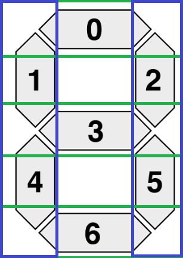
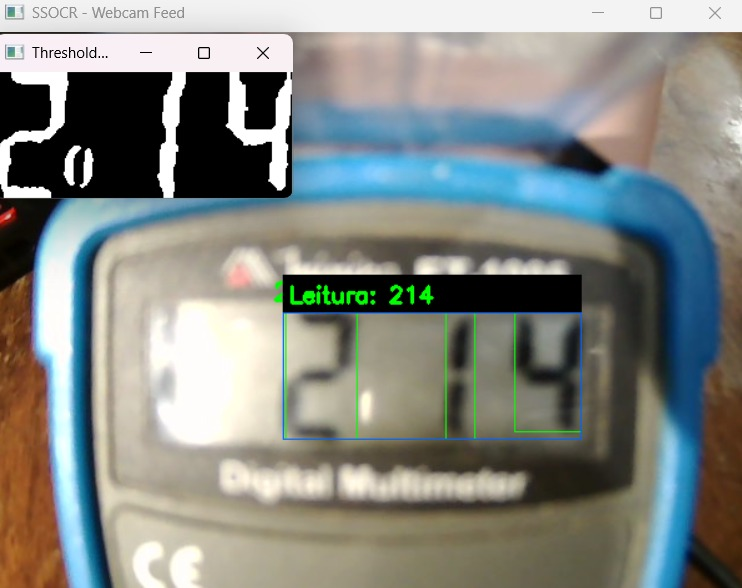

# Smart-Measure


Este projeto utiliza técnicas de processamento de imagens e visão computacional para reconhecer números exibidos em displays de sete segmentos.

A aplicação captura a imagem de uma câmera USB, permite que o usuário selecione a região do display e identifica os segmentos ativos de cada dígito. Para reduzir oscilações causadas por ruídos, iluminação ou falhas momentâneas de detecção, as leituras são armazenadas e estabilizadas por meio de uma votação entre os resultados mais recentes.

## Mapeamento de segmentos



O projeto representa uma alternativa para digitalizar a leitura de equipamentos que possuem displays, mas não oferecem conexão ou comunicação direta com outros sistemas.

---

# Demonstração

A aplicação realiza a captura do display por meio de uma câmera USB e permite selecionar manualmente a região que será analisada.

O fluxo principal é:

Captura da imagem > Seleção da região de interesse > Pré-processamento > Detecção dos dígitos > Análise dos segmentos > Estabilização da leitura

Durante a execução, são exibidas duas janelas:

- imagem original da câmera, contendo a região selecionada e o resultado reconhecido;
- imagem binarizada, utilizada para visualizar o resultado do pré-processamento.

## Controles

| Tecla | Função |
|---|---|
| `S` | Selecionar a região de interesse do display |
| `R` | Limpar a região selecionada e reiniciar a leitura |
| `Q` | Encerrar a aplicação |

## Exemplo de funcionamento



---

# Tecnologias Utilizadas

- Python;
- OpenCV;
- NumPy;
- Imutils.

---

# Estrutura do Projeto

```text
Smart-Measure/
│
├── images/
│   └── demonstracao.png
│
├── lib/
│   └── gabaritoSegmentos.png
│
├── src/
│   ├── __init__.py
│   ├── application.py
│   ├── config.py
│   ├── main.py
│   ├── preprocessing.py
│   ├── recognition.py
│   └── stabilization.py
│
├── requirements.txt
├── README.md
└── .gitignore
```

## Responsabilidade dos módulos

- `main.py`: ponto de entrada da aplicação;
- `application.py`: controla a câmera, a seleção da região de interesse e a interface;
- `config.py`: armazena as constantes utilizadas pelo projeto;
- `preprocessing.py`: realiza o tratamento e a binarização da imagem;
- `recognition.py`: detecta os contornos, analisa os segmentos ativos e reconhece os dígitos;
- `stabilization.py`: armazena as leituras recentes e determina o resultado mais frequente.

---

# Como Executar

## 1. Clone o repositório

```bash
git clone https://github.com/JoaoVitorDC25/Smart-Measure.git
```

## 2. Acesse a pasta do projeto

```bash
cd Smart-Measure
```

## 3. Instale as dependências

```bash
pip install -r requirements.txt
```

## 4. Execute a aplicação

```bash
python src/main.py
```

Após a inicialização, posicione o display em frente à câmera e pressione `S` para selecionar a região que contém os dígitos.

Por padrão, o programa procura uma câmera nos índices `1` e `2`. Esses valores podem ser alterados no arquivo `src/config.py`.

---

# Dependências

As dependências necessárias devem ser registradas no arquivo `requirements.txt`.

```text
numpy
opencv-python
imutils
```

---

# Conceitos Aplicados

Durante o desenvolvimento do projeto foram aplicados conceitos de programação, processamento de imagens e visão computacional:

- **Captura de vídeo:** obtenção contínua de imagens por meio de uma câmera USB;
- **Região de Interesse (ROI):** seleção da área específica da imagem que contém o display;
- **Conversão para escala de cinza:** redução da imagem para um único canal de intensidade;
- **Filtro de mediana:** redução de pequenos ruídos presentes na imagem;
- **Normalização:** redistribuição dos valores dos pixels para melhorar o contraste;
- **Threshold adaptativo:** transformação da imagem em uma representação binária, considerando diferenças locais de iluminação;
- **Detecção de contornos:** localização das regiões que podem representar os dígitos do display;
- **Filtragem de contornos:** seleção dos contornos com largura e altura compatíveis com os dígitos;
- **Operações morfológicas:** aplicação de dilatação para recuperar partes dos segmentos que possam ter sido reduzidas durante o processamento;
- **Reconhecimento de sete segmentos:** divisão de cada dígito em sete regiões e identificação dos segmentos ativos;
- **Mapeamento de padrões:** comparação dos segmentos detectados com padrões previamente definidos para os números de `0` a `9`;
- **Estabilização temporal:** utilização das leituras mais recentes para escolher o resultado que aparece com maior frequência;
- **Modularização:** separação das responsabilidades do projeto em diferentes arquivos;
- **Constantes de configuração:** centralização dos principais parâmetros de captura, processamento e reconhecimento.

---

# Limitações Atuais

- A região do display precisa ser selecionada manualmente;
- os parâmetros de detecção podem precisar de ajustes conforme o display utilizado;
- reflexos e variações de iluminação podem afetar o reconhecimento;
- o projeto reconhece somente números em displays de sete segmentos;
- ponto decimal e sinal negativo ainda não são identificados;
- a precisão depende da posição, distância e resolução da câmera;
- os padrões alternativos utilizados para reconhecer o número `1` precisam ser validados com diferentes imagens reais.

---

# Melhorias Futuras

- Reconhecimento do ponto decimal e do sinal negativo;
- seleção automática da região do display;
- correção de perspectiva para displays inclinados;
- criação de diferentes perfis de configuração;
- armazenamento das leituras em arquivo CSV;
- envio das leituras para outros dispositivos;
- desenvolvimento de uma interface para ajustar os parâmetros;
- criação de testes utilizando imagens reais de displays;
- avaliação da precisão do reconhecimento em diferentes condições de iluminação.

---

# Autor

**João Vitor Dias**

Técnico em Desenvolvimento de Produtos Eletrônicos, com interesse em Ciência de Dados, Machine Learning, visão computacional e desenvolvimento em Python.

GitHub: [https://github.com/JoaoVitorDC25](https://github.com/JoaoVitorDC25)

LinkedIn: [João Vitor Dias](https://www.linkedin.com/in/jo%C3%A3o-vitor-dias-14178a190/)

### Áreas de interesse

- Ciência de Dados;
- Inteligência Artificial;
- Machine Learning;
- Visão Computacional;
- Desenvolvimento em Python.

---

## Projeto em desenvolvimento

Este projeto integra meu portfólio de estudos em Python, processamento de imagens e visão computacional.
